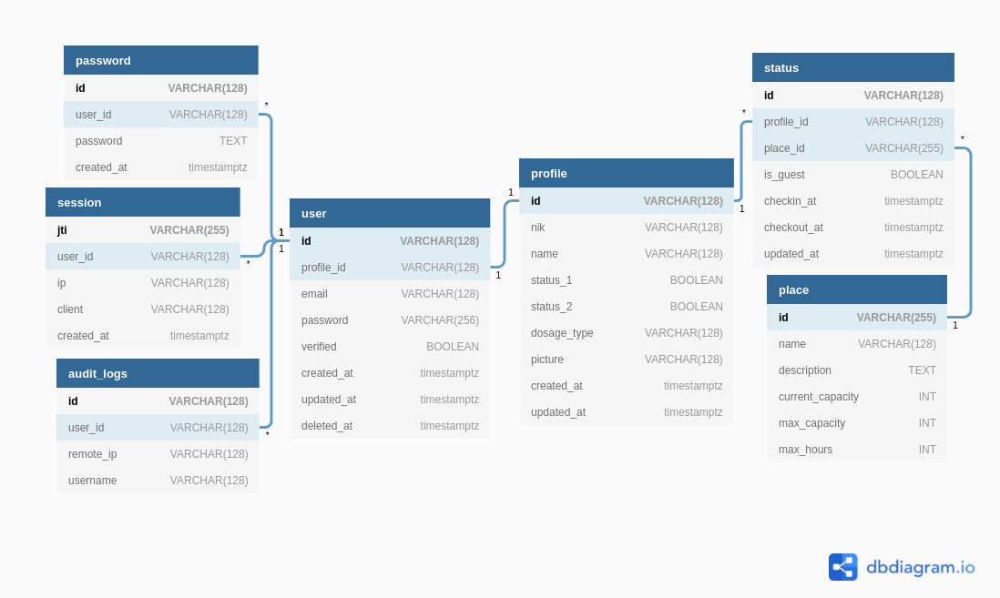

# 

## IH-Userland-Onboard

Userland is account self-management system for Ice House Onboarding Project

## API Contract

[https://userland.docs.apiary.io/#introduction/http-status-codes](https://userland.docs.apiary.io/#introduction/http-status-codes)

## Data Modeling

### Postgre Schema



#### 1. Postgresql script

```sql
CREATE TABLE IF NOT EXISTS "profile" (
  "id" VARCHAR(128) PRIMARY KEY,
  "nik" VARCHAR(128) UNIQUE,
  "name" VARCHAR(128),
  "status_1" BOOLEAN,
  "status_2" BOOLEAN,
  "dosage_type" VARCHAR(128),
  "picture" VARCHAR(128) NOT NULL DEFAULT '',
  "created_at" timestamptz NOT NULL DEFAULT (now()),
  "updated_at" timestamptz NOT NULL DEFAULT (now())
);

CREATE INDEX ON "profile" ("nik");

CREATE TABLE IF NOT EXISTS "place" (
  "id" VARCHAR(255) PRIMARY KEY,
  "name" VARCHAR(128),
  "description" TEXT,
  "current_capacity" INT,
  "max_capacity" INT,
  "max_hours" INT
);

CREATE INDEX ON "place" ("name");

CREATE TABLE IF NOT EXISTS "status" (
  "id" VARCHAR(128) PRIMARY KEY,
  "profile_id" VARCHAR(128),
  "place_id" VARCHAR(255),
  "is_guest" BOOLEAN NOT NULL DEFAULT FALSE,
  "checkin_at" timestamptz NOT NULL DEFAULT (now()),
  "checkout_at" timestamptz,
  "updated_at" timestamptz NOT NULL DEFAULT (now())
);

ALTER TABLE "status" ADD FOREIGN KEY ("profile_id") REFERENCES "profile" ("id");

ALTER TABLE "status" ADD FOREIGN KEY ("place_id") REFERENCES "place" ("id");

CREATE INDEX ON "status" ("profile_id");

CREATE INDEX ON "status" ("place_id");

CREATE TABLE IF NOT EXISTS "user" (
  "id" VARCHAR(128) PRIMARY KEY,
  "profile_id" VARCHAR(128),
  "email" VARCHAR(128),
  "password" VARCHAR(256),
  "verified" BOOLEAN,
  "created_at" timestamptz NOT NULL DEFAULT (now()),
  "updated_at" timestamptz NOT NULL DEFAULT (now()),
  "deleted_at" timestamptz
);

ALTER TABLE "user" ADD FOREIGN KEY ("profile_id") REFERENCES "profile" ("id");

CREATE INDEX ON "user" ("email");

CREATE INDEX ON "user" ("profile_id");

CREATE TABLE IF NOT EXISTS "password" (
  "id" VARCHAR(128) PRIMARY KEY,
  "user_id" VARCHAR(128),
  "password" TEXT,
  "created_at" timestamptz NOT NULL DEFAULT (now())
);

ALTER TABLE "password" ADD FOREIGN KEY ("user_id") REFERENCES "user" ("id");

CREATE INDEX ON "password" ("user_id");

CREATE TABLE IF NOT EXISTS "session" (
  "jti" VARCHAR(255) PRIMARY KEY,
  "user_id" VARCHAR(128),
  "ip" VARCHAR(128),
  "client" VARCHAR(128),
  "created_at" timestamptz NOT NULL DEFAULT (now())
);

ALTER TABLE "session" ADD FOREIGN KEY ("user_id") REFERENCES "user" ("id");

CREATE INDEX ON "session" ("user_id");

CREATE TABLE IF NOT EXISTS "audit_logs" (
  "id" VARCHAR(128) PRIMARY KEY,
  "user_id" VARCHAR(128),
  "remote_ip" VARCHAR(128) NOT NULL,
  "username" VARCHAR(128) NOT NULL
);

ALTER TABLE "audit_logs" ADD FOREIGN KEY ("user_id") REFERENCES "user" ("id");

CREATE INDEX ON "audit_logs" ("user_id");
```

#### 2. dbdiagram.io script

```sql
Table user {
  id VARCHAR(128) [pk]
  profile_id VARCHAR(128) [ref: - profile.id]
  email VARCHAR(128)
  password VARCHAR(256)
  verified BOOLEAN
  created_at timestamptz
  updated_at timestamptz
  deleted_at timestamptz
  
  indexes{
    email
  }
}

Table profile {
  id VARCHAR(128) [pk]
  nik VARCHAR(128) [unique]
  name VARCHAR(128) 
  status_1 BOOLEAN
  status_2 BOOLEAN
  dosage_type VARCHAR(128)
  picture VARCHAR(128)
  created_at timestamptz
  updated_at timestamptz
  
  indexes {
    nik
  }
}

Table place {
  id VARCHAR(255) [pk]
  name VARCHAR(128)
  description TEXT
  current_capacity INT
  max_capacity INT
  max_hours INT
  
  indexes{
    name
  }
}

Table status {
  id VARCHAR(128) [pk]
  profile_id VARCHAR(128) [ref: > profile.id]
  place_id VARCHAR(255) [ref: > place.id]
  is_guest BOOLEAN
  checkin_at timestamptz
  checkout_at timestamptz
  updated_at timestamptz
  
  indexes{
    profile_id
    place_id
  }
}

Table password {
  id VARCHAR(128) [pk]
  user_id VARCHAR(128) [ref: > user.id]
  password TEXT
  created_at timestamptz
  
  indexes {
    user_id
  }
}

Table session {
  jti VARCHAR(255) [pk]
  user_id VARCHAR(128) [ref: > user.id]
  ip VARCHAR(128)
  client VARCHAR(128)
  created_at timestamptz
  
  indexes{
    user_id
  }
}

Table audit_logs {
  id VARCHAR(128) [pk]
  user_id VARCHAR(128) [ref: > user.id]
  remote_ip VARCHAR(128)
  username VARCHAR(128)
  
  indexes{
    user_id
  }
}
```
